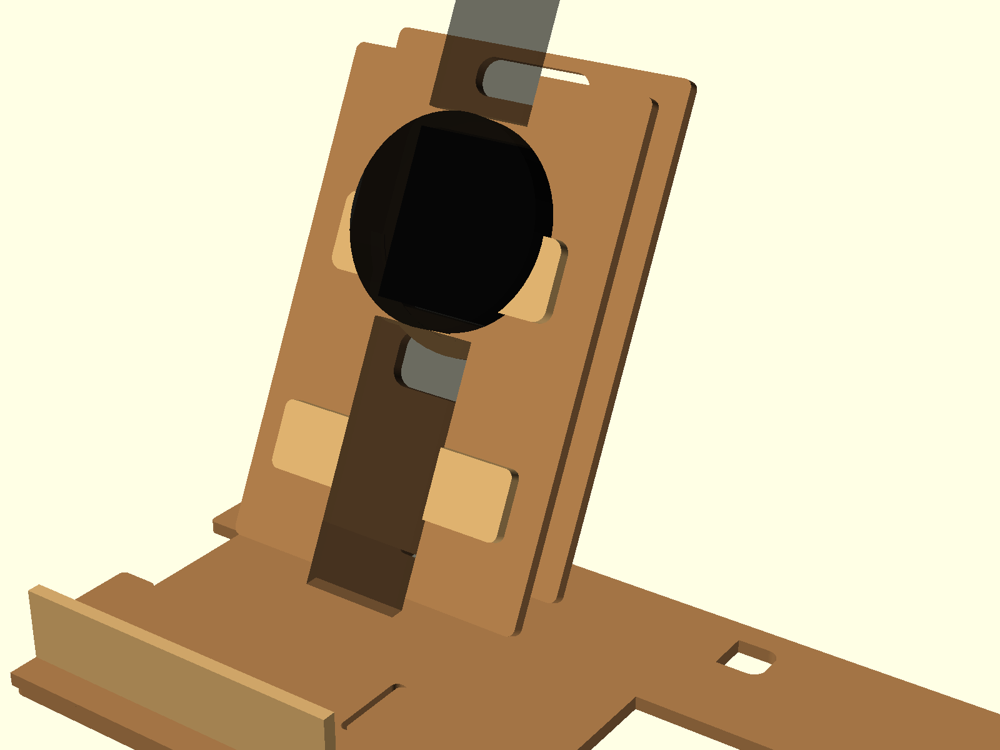
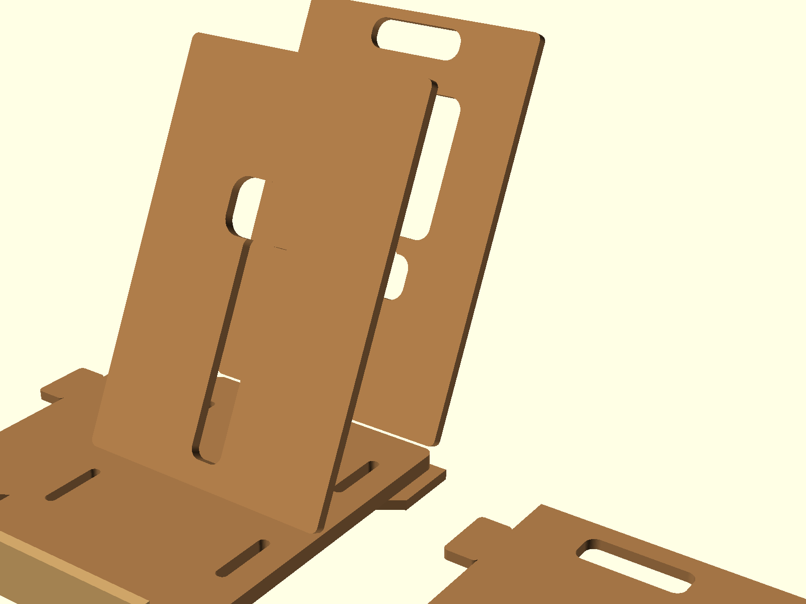
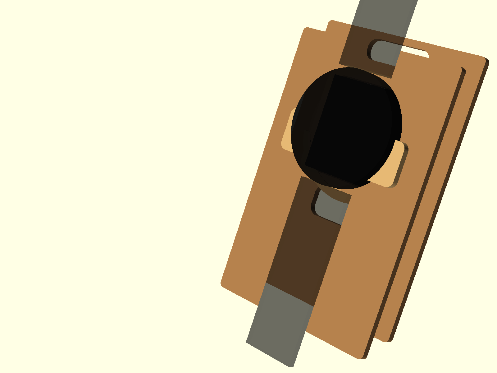
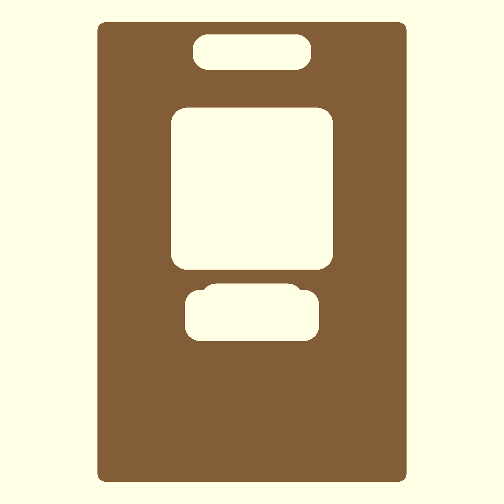
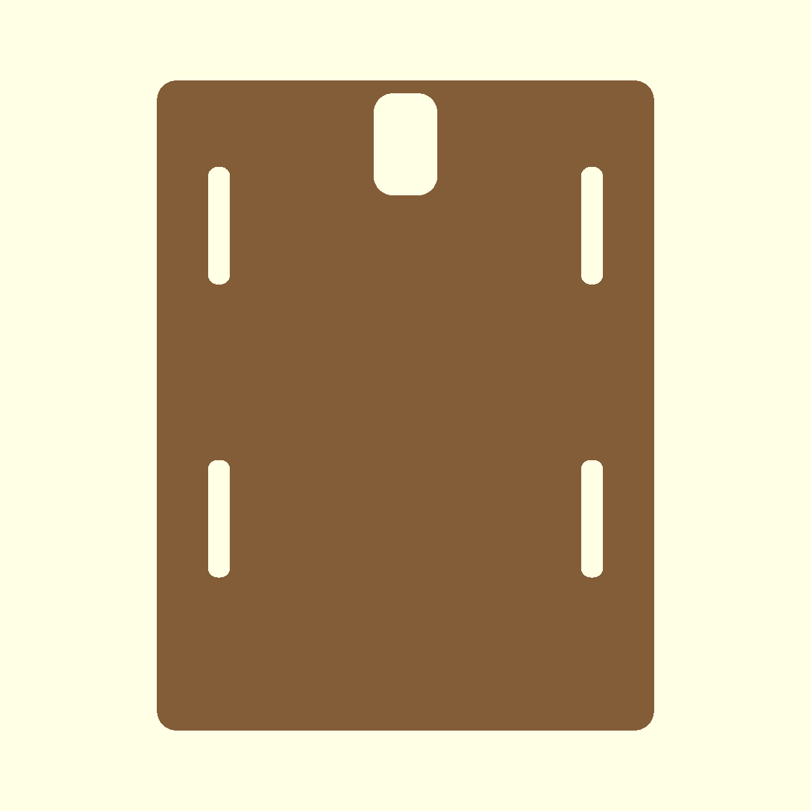

# Exported Maker Images

Generated from `xiaomi_watch_s4_cardboard_dock_hardboard_v2.scad` using OpenSCAD.

## Recommended Viewing Order

| File | Use |
| --- | --- |
| `images/v2_assembly.png` | Overall assembled dock preview with watch and charger dummy. |
| `images/v2_exploded_preview.png` | Relationship between main panels before assembly. |
| `images/v2_fit_check.png` | Charger/watch interface check. |
| `images/v2_test_coupon_2d.png` | Quick preview of the test coupon. |
| `images/v2_test_coupon_2d.svg` | Exact 2D test coupon drawing for inspection/export. |
| `images/v2_cut_layout_2d.png` | Preview of the standard full cut layout. |
| `images/v2_cut_layout_2d.svg` | Exact standard full cut layout. |
| `images/v2_beginner_cut_layout_2d.png` | Preview of the beginner full cut layout. |
| `images/v2_beginner_cut_layout_2d.svg` | Exact beginner full cut layout with solid side panels and helpers. |
| `images/v2_front_panel.png` | Front panel reference. |
| `images/v2_rear_panel.png` | Rear panel reference. |
| `images/v2_side_panel.png` | Side panel reference. |
| `images/v2_base_panel.png` | Base panel reference. |

## Preview Sheet

### Assembly

### Exploded Preview

### Fit Check

### Test Coupon

### Standard Cut Layout

### Beginner Cut Layout

### Main Parts

## Notes

- Use SVG files for exact 2D inspection or downstream vector export.
- PNG files are visual references and may not preserve exact scale.
- Cut the test coupon before the full layout and update the SCAD parameters from real fit results.

## A4 Hand-Cut Templates

For printing on A4 paper and tracing onto hardboard, use:

- `build-manual-ko.html`
- `../a4-print-guide-ko.md`
- `a4-templates/a4_00_cut_list.svg`
- `a4-templates/a4_01_test_coupon.svg`
- `a4-templates/a4_02_front_rear.svg`
- `a4-templates/a4_03_base.svg`
- `a4-templates/a4_04_side_panels.svg`
- `a4-templates/a4_05_small_parts.svg`
